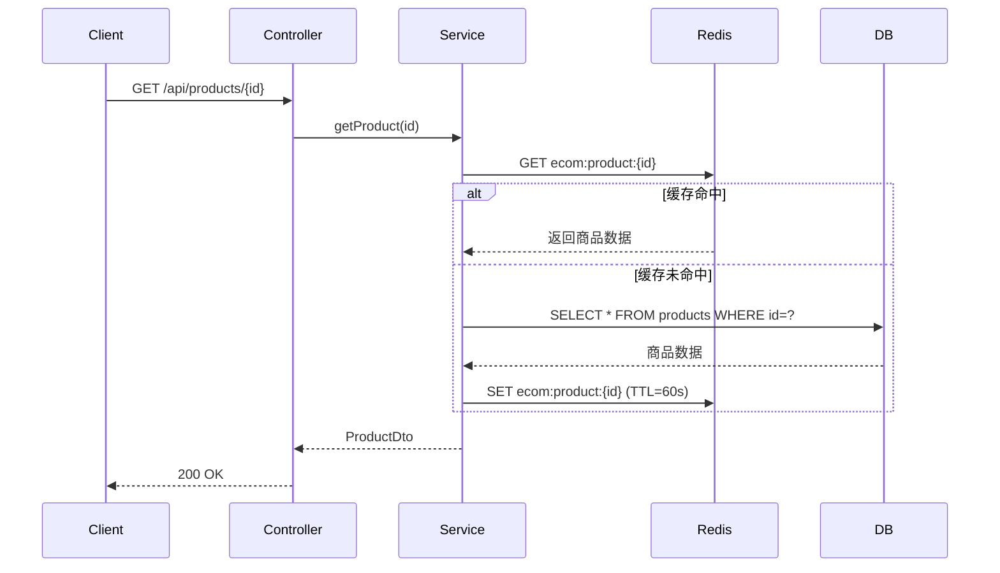
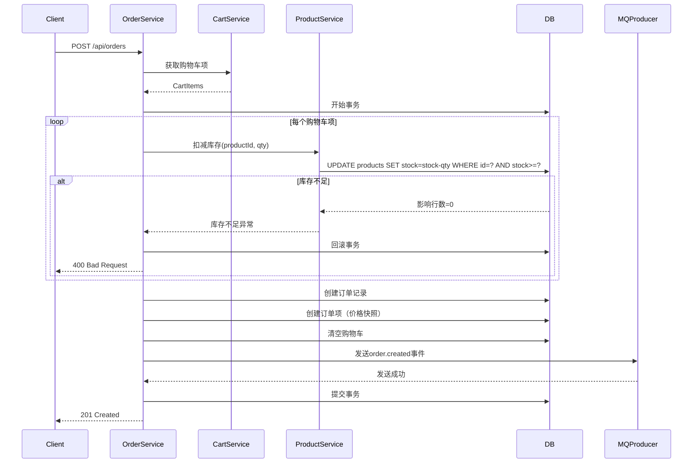

# 电商平台基础框架 - 架构师输出文档

## 一、PRD（产品需求文档）补充建议

### 1.1 MVP核心功能完善
**用户端功能：**
- 用户注册/登录/登出
- 商品浏览（列表/详情/搜索）
- 购物车管理（增删改查）
- 订单创建与查看
- 个人中心（基本信息、订单历史）

**管理端功能（后续阶段）：**
- 商品管理（CRUD）
- 订单管理
- 用户管理
- 数据统计看板

### 1.2 核心业务流程
```
用户注册 → 登录 → 浏览商品 → 加入购物车 → 创建订单 → 支付（TODO）→ 订单完成
```

### 1.3 非功能需求
- 响应时间：商品列表<500ms，详情<300ms（缓存命中）
- 可用性：99.9%
- 安全性：JWT认证、密码加密、SQL注入防护

## 二、架构设计深化

### 2.1 系统架构图
```
┌─────────────────┐    ┌─────────────────┐    ┌─────────────────┐
│   React前端     │←→│  Spring Boot    │←→│    MySQL        │
│   (Vite+TS)     │    │   API网关        │    │   (主数据)      │
└─────────────────┘    └─────────────────┘    └─────────────────┘
                              ↑  ↓                    ↑
                         ┌─────────────────┐    ┌─────────────────┐
                         │    Redis        │←→│   RocketMQ      │
                         │   (缓存)        │    │   (异步消息)     │
                         └─────────────────┘    └─────────────────┘
```

### 2.2 后端模块细化
```
backend/
├── src/main/java/com/ecommerce/
│   ├── common/           # 公共组件
│   │   ├── config/      # 配置类
│   │   ├── constants/   # 常量
│   │   ├── exception/   # 异常处理
│   │   ├── utils/       # 工具类
│   │   └── aop/         # 切面（日志/监控）
│   ├── auth/            # 认证模块
│   │   ├── controller/  # AuthController
│   │   ├── service/     # AuthService
│   │   ├── dto/         # LoginRequest/RegisterRequest
│   │   └── filter/      # JwtAuthenticationFilter
│   ├── catalog/         # 商品模块
│   │   ├── controller/  # ProductController
│   │   ├── service/     # ProductService（带缓存）
│   │   ├── repository/  # ProductRepository
│   │   └── dto/         # ProductDto
│   ├── cart/           # 购物车模块
│   ├── order/          # 订单模块
│   ├── mq/             # 消息队列模块
│   └── Application.java
└── resources/
    ├── application.yml
    └── db/migration/    # Flyway迁移脚本
```

### 2.3 关键时序流程

#### 2.3.1 商品详情获取（缓存策略）


#### 2.3.2 下单流程（事务+MQ）


## 三、数据模型（对齐现有SQL）

### 3.1 核心表结构
```sql
-- 用户表（已存在）
CREATE TABLE users (
    id BIGINT AUTO_INCREMENT PRIMARY KEY,
    email VARCHAR(255) UNIQUE NOT NULL,
    password_hash VARCHAR(255) NOT NULL,  -- BCrypt加密
    role ENUM('USER', 'ADMIN') DEFAULT 'USER',
    created_at TIMESTAMP DEFAULT CURRENT_TIMESTAMP
);

-- 商品表（已存在）
CREATE TABLE products (
    id BIGINT AUTO_INCREMENT PRIMARY KEY,
    title VARCHAR(255) NOT NULL,
    description TEXT,
    price_cents INT NOT NULL,  -- 以分为单位，避免浮点误差
    currency VARCHAR(3) DEFAULT 'USD',
    stock INT NOT NULL DEFAULT 0,
    image_url VARCHAR(500),
    active BOOLEAN DEFAULT TRUE,
    created_at TIMESTAMP DEFAULT CURRENT_TIMESTAMP
);

-- 购物车表
CREATE TABLE carts (
    id BIGINT AUTO_INCREMENT PRIMARY KEY,
    user_id BIGINT NOT NULL,
    UNIQUE KEY uk_user (user_id),
    FOREIGN KEY (user_id) REFERENCES users(id)
);

-- 购物车项表
CREATE TABLE cart_items (
    id BIGINT AUTO_INCREMENT PRIMARY KEY,
    cart_id BIGINT NOT NULL,
    product_id BIGINT NOT NULL,
    quantity INT NOT NULL DEFAULT 1,
    unit_price_cents INT NOT NULL,  -- 加入时的价格快照
    added_at TIMESTAMP DEFAULT CURRENT_TIMESTAMP,
    FOREIGN KEY (cart_id) REFERENCES carts(id),
    FOREIGN KEY (product_id) REFERENCES products(id),
    UNIQUE KEY uk_cart_product (cart_id, product_id)
);

-- 订单表
CREATE TABLE orders (
    id BIGINT AUTO_INCREMENT PRIMARY KEY,
    order_no VARCHAR(32) UNIQUE NOT NULL,  -- 订单号（业务用）
    user_id BIGINT NOT NULL,
    total_cents INT NOT NULL,
    currency VARCHAR(3) DEFAULT 'USD',
    status ENUM('PENDING', 'PAID', 'SHIPPED', 'DELIVERED', 'CANCELLED') DEFAULT 'PENDING',
    created_at TIMESTAMP DEFAULT CURRENT_TIMESTAMP,
    FOREIGN KEY (user_id) REFERENCES users(id)
);

-- 订单项表（价格快照）
CREATE TABLE order_items (
    id BIGINT AUTO_INCREMENT PRIMARY KEY,
    order_id BIGINT NOT NULL,
    product_id BIGINT NOT NULL,
    product_title VARCHAR(255) NOT NULL,  -- 下单时的标题快照
    quantity INT NOT NULL,
    unit_price_cents INT NOT NULL,  -- 下单时的价格快照
    FOREIGN KEY (order_id) REFERENCES orders(id),
    FOREIGN KEY (product_id) REFERENCES products(id)
);
```

### 3.2 索引建议
```sql
-- 商品表
CREATE INDEX idx_products_active ON products(active);
CREATE INDEX idx_products_created ON products(created_at DESC);

-- 订单表
CREATE INDEX idx_orders_user ON orders(user_id);
CREATE INDEX idx_orders_created ON orders(created_at DESC);
CREATE UNIQUE INDEX idx_orders_no ON orders(order_no);

-- 购物车项
CREATE INDEX idx_cart_items_cart ON cart_items(cart_id);

-- 订单项
CREATE INDEX idx_order_items_order ON order_items(order_id);
```

## 四、API设计（对齐docs/API.md）

### 4.1 认证API
```yaml
POST /api/auth/register:
  request:
    email: string (格式校验)
    password: string (最小长度8)
  response:
    accessToken: string
    expiresIn: number

POST /api/auth/login:
  request: 同register
  response: 同register

# 可扩展：刷新token、登出、修改密码
```

### 4.2 商品API
```yaml
GET /api/products:
  query:
    page: number (默认0)
    size: number (默认10, 最大100)
    category?: string (后续扩展)
    search?: string (后续扩展)
  response:
    content: ProductDto[]
    totalElements: number
    totalPages: number

GET /api/products/{id}:
  response: ProductDto (带缓存)

# 后续管理端API
POST /api/admin/products: 创建商品
PUT /api/admin/products/{id}: 更新商品（需清理缓存）
DELETE /api/admin/products/{id}: 删除商品
```

### 4.3 购物车API
```yaml
GET /api/cart:
  headers:
    Authorization: Bearer {token}
  response:
    items: CartItemDto[]
    totalPriceCents: number

POST /api/cart/items:
  headers: Authorization
  request:
    productId: number
    quantity: number (默认1, 最小1)
  response: CartItemDto

PUT /api/cart/items/{id}:
  headers: Authorization
  request:
    quantity: number
  response: CartItemDto

DELETE /api/cart/items/{id}:
  headers: Authorization
```

### 4.4 订单API
```yaml
POST /api/orders:
  headers: Authorization
  response: OrderDto

GET /api/orders:
  headers: Authorization
  query:
    page: number
    size: number
  response: 分页订单列表

GET /api/orders/{id}:
  headers: Authorization
  response: OrderDetailDto

# 后续扩展
POST /api/orders/{id}/cancel: 取消订单（库存回滚）
```

## 五、测试计划

### 5.1 单元测试（覆盖率>80%）
**后端测试：**
```java
// 示例：ProductService单元测试
@ExtendWith(MockitoExtension.class)
class ProductServiceTest {
    @Mock
    private ProductRepository productRepository;
    @Mock
    private RedisTemplate<String, ProductDto> redisTemplate;
    
    @InjectMocks
    private ProductService productService;
    
    @Test
    void getProductById_cacheHit() {
        // 模拟缓存命中
        when(redisTemplate.opsForValue().get("ecom:product:1"))
            .thenReturn(mockProductDto);
        
        ProductDto result = productService.getProduct(1L);
        
        assertNotNull(result);
        verify(productRepository, never()).findById(any());
    }
    
    @Test
    void getProductById_cacheMiss() {
        // 模拟缓存未命中，DB查询
        when(redisTemplate.opsForValue().get(anyString()))
            .thenReturn(null);
        when(productRepository.findById(1L))
            .thenReturn(Optional.of(mockProduct));
        
        ProductDto result = productService.getProduct(1L);
        
        assertNotNull(result);
        verify(redisTemplate).opsForValue().set(anyString(), any(), anyLong());
    }
}
```

**前端测试：**
- React组件测试（Jest + Testing Library）
- 用户交互测试
- API调用模拟

### 5.2 集成测试
```java
@SpringBootTest
@AutoConfigureMockMvc
class OrderIntegrationTest {
    @Autowired
    private MockMvc mockMvc;
    
    @Test
    @Transactional
    void createOrder_success() throws Exception {
        // 1. 创建测试用户并获取token
        String token = createUserAndGetToken();
        
        // 2. 添加商品到购物车
        addToCart(token, productId, 2);
        
        // 3. 创建订单
        mockMvc.perform(post("/api/orders")
                .header("Authorization", "Bearer " + token))
                .andExpect(status().isCreated())
                .andExpect(jsonPath("$.orderNo").exists());
        
        // 4. 验证库存已扣减
        assertProductStock(productId, originalStock - 2);
        
        // 5. 验证购物车已清空
        assertCartEmpty(token);
        
        // 6. 验证MQ消息发送（可mock验证）
    }
}
```

### 5.3 E2E测试（Cypress）
```javascript
describe('订单流程', () => {
  it('用户下单成功', () => {
    // 1. 登录
    cy.login('test@example.com', 'password123');
    
    // 2. 浏览商品
    cy.visit('/products');
    cy.get('[data-testid="product-card"]').first().click();
    
    // 3. 加入购物车
    cy.get('[data-testid="add-to-cart"]').click();
    cy.get('[data-testid="cart-badge"]').should('contain', '1');
    
    // 4. 下单
    cy.visit('/cart');
    cy.get('[data-testid="checkout-button"]').click();
    
    // 5. 验证订单创建
    cy.url().should('include', '/orders/');
    cy.get('[data-testid="order-status"]').should('contain', 'PENDING');
  });
});
```

### 5.4 性能测试
- 使用JMeter模拟并发用户
- 重点测试：
  - 商品列表分页（1000并发）
  - 商品详情缓存（2000并发）
  - 下单事务（500并发）

## 六、开发计划（4周迭代）

### 第1周：基础框架搭建
**目标：** 可运行的MVP骨架
- [ ] 初始化Spring Boot项目（3.2+）
- [ ] 配置MySQL + Redis + RocketMQ（Docker Compose）
- [ ] 用户认证模块（JWT）
- [ ] 商品模块基础（CRUD + 缓存）
- [ ] 基础前端页面（React + Vite）
- [ ] 编写DB迁移脚本（Flyway）

### 第2周：核心业务实现
**目标：** 完成购物车和下单流程
- [ ] 购物车模块（添加/删除/修改）
- [ ] 订单模块（事务处理）
- [ ] RocketMQ生产者集成
- [ ] 前端购物车页面
- [ ] 前端下单页面
- [ ] 单元测试框架搭建

### 第3周：完善与优化
**目标：** 提升系统健壮性
- [ ] 全局异常处理
- [ ] 输入参数验证
- [ ] 日志监控（SLF4J + Logback）
- [ ] 接口文档（SpringDoc OpenAPI 3）
- [ ] 性能优化（连接池、索引）
- [ ] 集成测试编写

### 第4周：部署与文档
**目标：** 可部署的完整系统
- [ ] Docker镜像构建
- [ ] 环境配置分离（dev/prod）
- [ ] 健康检查端点
- [ ] 部署脚本编写
- [ ] 用户手册编写
- [ ] 压力测试与调优

## 七、代码骨架建议

### 7.1 后端代码规范
```java
// 统一响应格式
@Data
@AllArgsConstructor
@NoArgsConstructor
public class ApiResponse<T> {
    private boolean success;
    private String code;      // 业务错误码
    private String message;   // 用户友好消息
    private T data;
    private Long timestamp = System.currentTimeMillis();
    
    public static <T> ApiResponse<T> success(T data) {
        return new ApiResponse<>(true, "SUCCESS", "操作成功", data);
    }
    
    public static ApiResponse<?> error(String code, String message) {
        return new ApiResponse<>(false, code, message, null);
